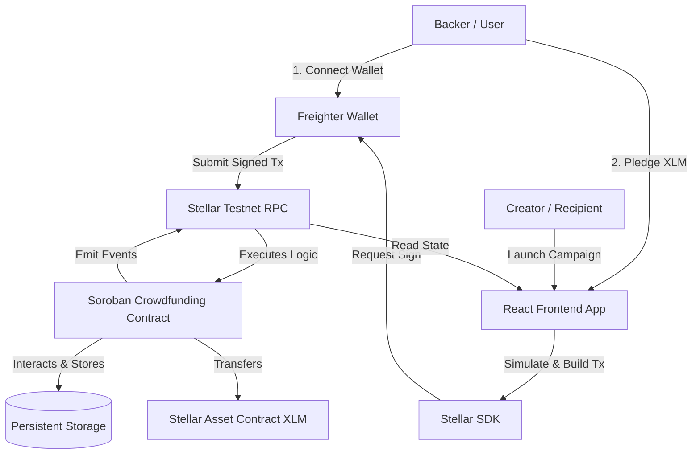
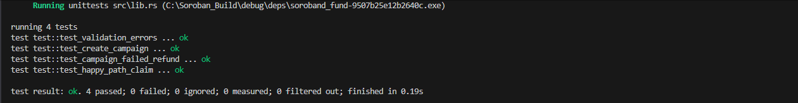
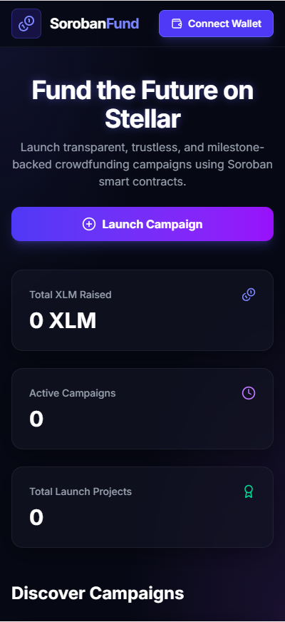
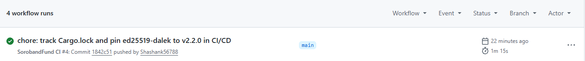

# SorobandFund

A decentralized, trustless multi-campaign crowdfunding platform built on the **Stellar Network** using **Soroban Smart Contracts** and a modern, mobile-responsive **React (Vite + TypeScript + Tailwind CSS)** frontend.

---

## 🌟 Features
- **Multi-Campaign Hosting**: Deploy one manager contract that handles any number of individual crowdfunding campaigns.
- **Milestone & Safety Focused**: Deadlines and target amounts are strictly enforced on-chain.
- **Automated Claims**: If the target goal is met by the deadline, campaign recipients can claim funds.
- **Risk-Free Refunds**: If the campaign expires without hitting its goal, backers can claim 100% of their pledged funds back instantly.
- **Freighter Wallet Integration**: Seamless transactions and status checks directly via the browser wallet extension.
- **Vibrant Neon-Glassmorphic Design**: An immersive, dark-themed responsive dashboard.

---

## 📐 Architecture



---

## 📁 Repository Structure

```text
Soroban/
├── .github/
│   └── workflows/
│       └── ci.yml             # GitHub Actions CI testing & building pipeline
├── contracts/
│   └── crowdfunding/
│       ├── src/
│       │   ├── lib.rs         # Soroban smart contract logic & event emitters
│       │   └── test.rs        # Smart contract unit tests
│       └── Cargo.toml         # Contract cargo dependencies
├── frontend/
│   ├── src/
│   │   ├── assets/            # UI icons and static image assets
│   │   ├── contracts/
│   │   │   └── crowdfunding.ts# Freighter API and Stellar SDK wrapper
│   │   ├── App.tsx            # Interactive Web3 dashboard layout
│   │   ├── index.css          # Tailwind CSS v4 variables & custom keyframes
│   │   └── main.tsx           # React bootstrap entry point
│   ├── package.json           # Node scripts and dependencies
│   ├── postcss.config.js      # PostCSS Tailwind build processor
│   └── vite.config.ts         # Vite build configuration
├── scripts/
│   ├── deploy.ps1             # Windows CLI deployment automating script
│   └── deploy.sh              # Unix/macOS/WSL deployment script
├── Cargo.toml                 # Root workspace Rust settings
├── LICENSE                    # MIT License open source file
└── README.md                  # Project documentation (this file)
```

---

## 🛠️ Local Development Setup

### Prerequisites
- **Rust Toolchain**: [Install Rust](https://www.rust-lang.org/tools/install) (Ensure `wasm32-unknown-unknown` target is added).
- **Node.js**: [Install Node.js v20+](https://nodejs.org/).
- **Stellar CLI**: Install using `cargo install --locked stellar-cli` or via package managers.
- **Freighter Wallet**: [Install extension](https://www.freighter.app/) and switch network to **Testnet**.

---

### 1. Smart Contract Development & Testing

Navigate to the project root:
```bash
# Add target
rustup target add wasm32-unknown-unknown

# Run the Rust unit tests
cargo test
```

To compile the contract to a Wasm binary:
```bash
cargo build --target wasm32-unknown-unknown --release
```

---

### 2. Frontend Development

Navigate to the `frontend/` directory:
```bash
cd frontend

# Install Node modules
npm install

# Start local hot-reload dev server
npm run dev
```

---

## 🚀 Deployed Addresses & Links (Submission Details)

- **Live Frontend Demo**: [https://soroband-fund.vercel.app/](https://soroband-fund.vercel.app/) *(Fill in once deployed)*
- **Smart Contract ID**: `CCZROZERIRNUOZVPZJQCE5OSGKPJNDHPVYOW4ZMLFLMO5K47ZFW2EIG7`
- **Example Transaction Hash (Pledge/Creation)**: `e585d3a594f40e3f8a78e6db76fd4159b8796de5da90113ddee07a0138803928`
- **Demo Video (Loom/YouTube)**: [Watch Walkthrough](https://youtu.be/placeholder) *(Replace with unlisted walkthrough)*

---

## 📸 Screenshots

### 1. Passing Unit Tests (3+ Tests)
*Place screenshot showing cargo test success under `assets/test-output.png`*


### 2. Mobile Responsive Web UI (375px wide)
*Place screenshot of mobile device mock in browser dev tools under `assets/mobile-ui.png`*


### 3. CI/CD Green Run Pipeline (GitHub Actions)
*Place screenshot of GitHub Actions green run under `assets/ci-pipeline.png`*


---

## 📜 License
Licensed under the **MIT License**. Details available in the [LICENSE](LICENSE) file.
